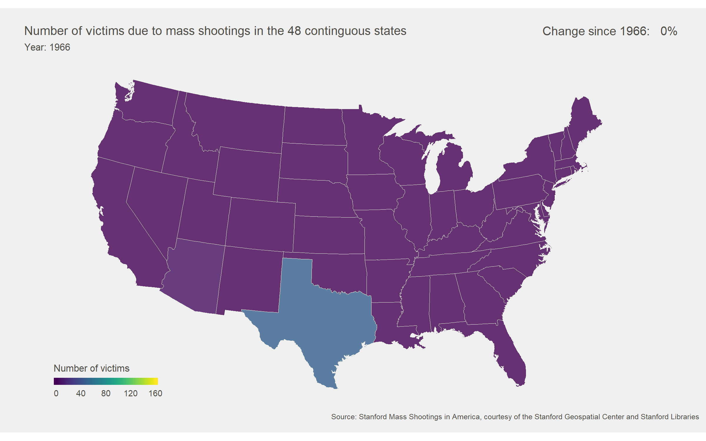

Mass Shootings in the United States, 1966 - 2016
================================================

Convincing the public that an issue really is an issue can often be the most difficult part of working in public health and science. Mass shootings in the United States have become a public health concern within the past five years, however heated debate has ensued over what to do or if we are just more aware then ever about events nationwide. The goal of this animated choropleth is to show that the latter is false and that the number of people affected by mass shootings within the past couple of years has increasingly grown. The map currently stops at 2016 because the data source stopped collection at that point. 

